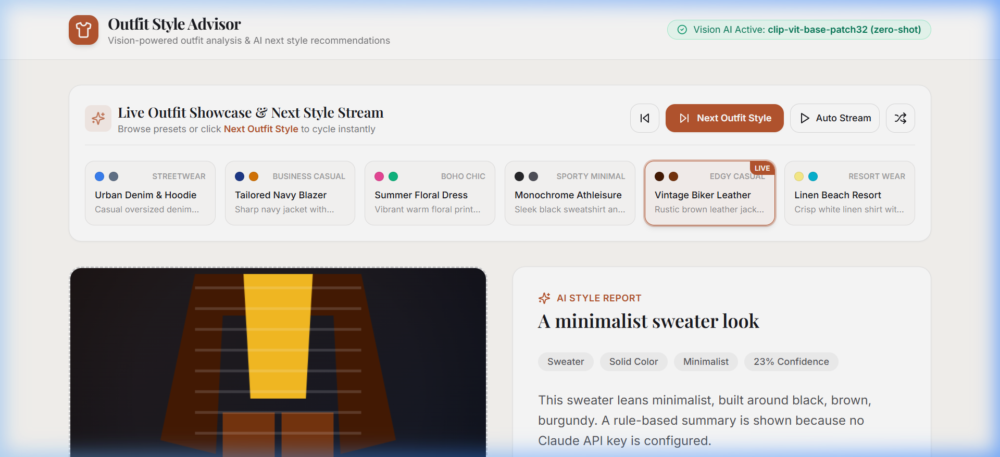
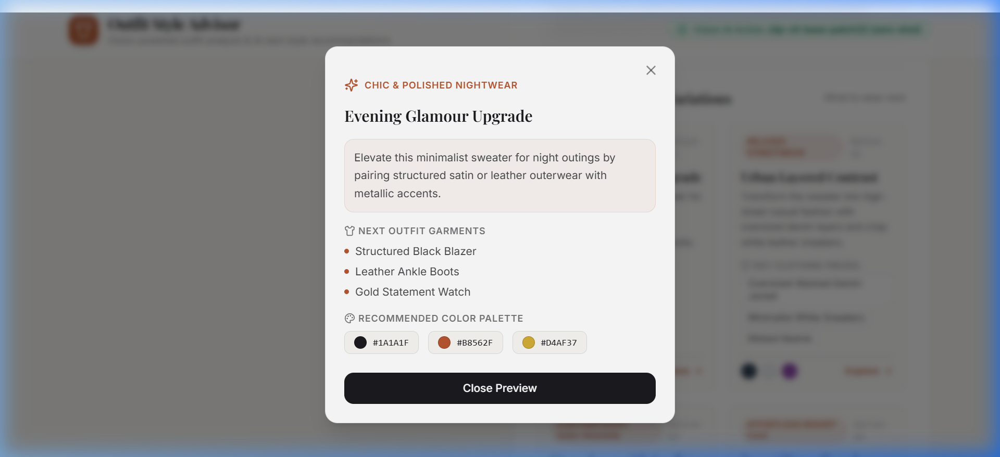

<div align="center">

# 👗 Outfit Style Advisor — Classical CV & Handcrafted Fashion Advisor

### *Deterministic Image Analysis, K-Means Color Theory & Handcrafted Fashion Recommendations*

[](https://python.org)
[](https://fastapi.tiangolo.com)
[](https://opencv.org)
[](https://scikit-learn.org)
[](https://react.dev)
[](https://tailwindcss.com)
[](https://sqlalchemy.org)
[](https://docker.com)
[](https://github.com/piku020505/OutfitStyleAdvisor/actions)

<p align="center">
  <a href="#-architecture--pipeline-design">Pipeline & Architecture</a> •
  <a href="#-key-features">Key Features</a> •
  <a href="#-application-showcase">Showcase</a> •
  <a href="#-tech-stack">Tech Stack</a> •
  <a href="#-getting-started">Getting Started</a> •
  <a href="#-api-documentation">API Docs</a>
</p>

---

</div>

> [!NOTE]
> **Deterministic & Lightweight Architecture**: This application runs a **100% deterministic classical computer vision and heuristic fashion rule pipeline** (OpenCV edge density/aspect ratio heuristics, Scikit-Learn K-Means color clustering, and a handcrafted fashion rule engine). It requires **no external LLM API keys** (e.g. Anthropic/Claude) and **no heavy PyTorch/Transformers dependencies**, ensuring sub-10ms response times, zero API costs, and full offline execution capability.

> [!TIP]
> **CORS & Environment Note**: CORS middleware is open (`*`) for local demo and preview convenience; production deployments restrict origins to explicit frontend domains via the `ALLOWED_ORIGINS` environment variable.

---

## 📸 Application Showcase

### 1. 🧥 Live Outfit Showcase & Style Dashboard
> Real-time garment feature extraction, Scikit-Learn **K-Means dominant color extraction**, and handcrafted fashion analysis.

<div align="center">
  
</div>

<br/>

### 2. ✨ Next Outfit Style Variations & Evolution Studio
> Interactive **"What to Wear Next"** recommendation engine providing 4 structured outfit transition concepts with color harmony swatches and key garment pairing suggestions.

<div align="center">
  
</div>

<br/>

### 3. 🔒 User Auth Session & Saved Outfit History Drawer
> Complete OAuth2 **Bearer JWT Authentication** (`bcrypt` password hashing) with async database persistence (**SQLAlchemy 2.0**) for auto-saving user analysis history.

<div align="center">
  
</div>

---

## 🌟 Key Features

- 📐 **Classical Feature Classification Engine**: Classical image processing heuristics (aspect ratio geometry, Sobel edge density metrics, and color variance histograms via OpenCV & Pillow) for fast, lightweight garment and pattern tagging.
- 🎨 **K-Means Color Theory Processor**: Scikit-Learn k-means clustering over RGB pixel arrays to compute dominant color distributions and map them to curated fashion palettes.
- 👗 **Handcrafted Fashion Recommendation Engine**: Custom fashion rule matrix generating structured styling reports strictly grounded in detected garment attributes.
- ⏭️ **"What to Wear Next" Evolution Engine**: Generates 4 tailored outfit transition variations (*Evening Glamour*, *Urban Streetwear*, *Monochrome Minimalist*, *Resort Warm-Toned*).
- 🔒 **Enterprise JWT Authentication**: Full user signup & login flow using `passlib` bcrypt hashing and signed JWT bearer tokens (`/api/auth/register`, `/api/auth/login`, `/api/auth/me`).
- 💾 **Async Database Layer**: Built on **SQLAlchemy 2.0 Async** (`aiosqlite` SQLite for local zero-config, `asyncpg` PostgreSQL for production database clusters).
- 🗂️ **Saved Outfit History Drawer**: Slide-over drawer allowing authenticated users to browse past outfit analyses, reload reports with 1-click, or manage saved items.
- ⏭️ **Live Outfit Carousel & Auto Stream**: Interactive preset bar featuring 6 high-definition canvas outfit presets, 1-click **Next Outfit Style** rotation, and auto-play showcase timer.
- 🐳 **Multi-Stage Docker Architecture**: `docker-compose.yml` orchestrating PostgreSQL database, FastAPI async application server, and Vite React frontend.
- 🔄 **Production CI/CD Pipeline**: GitHub Actions workflow running backend Pytest suites, verifying frontend production compilation, and validating container builds.

---

## 🧠 Architecture & Pipeline Design

```
                       +-----------------------------------+
                       |        Outfit Photo / Preset      |
                       +-----------------------------------+
                                          |
                                          v
                +---------------------------------------------------+
                |               FastAPI Async REST API              |
                +---------------------------------------------------+
                     |                                  |
                     v                                  v
+------------------------------------+   +------------------------------------+
|  Manual Feature Classifier (CV)    |   |     K-Means Color Analyzer         |
|  - Aspect Ratio & Geometry         |   |  - Scikit-Learn RGB Clustering     |
|  - Sobel Edge Density (OpenCV)     |   |  - Named Color & Palette Mapping   |
+------------------------------------+   +------------------------------------+
                     |                                  |
                     +----------------+-----------------+
                                      |
                                      v
                        +---------------------------+
                        |  Fashion Styling Engine   |
                        |  - Handcrafted Rule Matrix|
                        |  - Occasion Grounding     |
                        |  - Next Style Evolution   |
                        +---------------------------+
                                      |
                                      v
                        +---------------------------+
                        |    SQLAlchemy 2.0 Async   |
                        | (SQLite / PostgreSQL DB)  |
                        +---------------------------+
                                      |
                                      v
                        +---------------------------+
                        |  Vite React 18 Dashboard  |
                        +---------------------------+
```

---

## 🛠️ Tech Stack

| Layer | Technologies & Libraries |
|---|---|
| **Frontend UI** | React 18, Vite, Tailwind CSS, Lucide React Icons |
| **Backend API** | FastAPI 0.115, Pydantic v2, Python 3.12 |
| **Database & ORM** | SQLAlchemy 2.0 Async, SQLite (`aiosqlite`), PostgreSQL (`asyncpg`) |
| **Authentication** | OAuth2 Bearer, PyJWT, Passlib (`bcrypt`), Email-Validator |
| **Image Processing** | Pillow, OpenCV (`opencv-python-headless`), NumPy |
| **Color Processing** | Scikit-Learn K-Means Clustering, NumPy, Webcolors |
| **Fashion Recommendation** | Handcrafted Fashion Rule Engine (`app/stylist.py`) & Palette Matrix |
| **Testing** | Pytest, FastAPI TestClient |
| **DevOps & Cloud** | Docker, Docker Compose, GitHub Actions CI/CD, Render Spec |

---

## 🔌 API Documentation Reference

| Endpoint | Method | Auth Required | Description |
|---|---|---|---|
| `/` | `GET` | No | Service status and API version |
| `/api/health` | `GET` | No | System health, style engine, & DB status |
| `/api/auth/register` | `POST` | No | Register a new user account & return JWT token |
| `/api/auth/login` | `POST` | No | Authenticate user credentials & return JWT token |
| `/api/auth/me` | `GET` | Yes | Get authenticated user profile details |
| `/api/analyze` | `POST` | Optional | Analyze outfit photo; auto-saves history if authenticated |
| `/api/history` | `GET` | Yes | Retrieve user's saved outfit style analyses |
| `/api/history/{id}` | `DELETE` | Yes | Delete a saved outfit analysis entry |

---

## 🚀 Quickstart Guide

### Option A — Docker Compose (Recommended)

Run the full stack (PostgreSQL + FastAPI Backend + React Frontend) with a single command:

```bash
docker-compose up --build
```
- **Frontend Dashboard**: `http://localhost:5173`
- **Backend Interactive Docs**: `http://localhost:8000/docs`

---

### Option B — Run Locally

#### 1. Backend Setup
```bash
cd backend

# Create virtual environment
uv venv venv --python 3.12
venv\Scripts\activate

# Install dependencies
uv pip install -r requirements.txt

# Start FastAPI server
uvicorn app.main:app --reload --port 8000
```

#### 2. Frontend Setup
```bash
cd frontend

# Install Node packages
npm install

# Start Vite dev server
npm run dev
```

Open **`http://localhost:5173`** in your browser.

---

## 🧪 Running Automated Tests

```bash
cd backend
venv\Scripts\pytest -v
```

---

## 📄 License

Distributed under the MIT License. See `LICENSE` for details.
